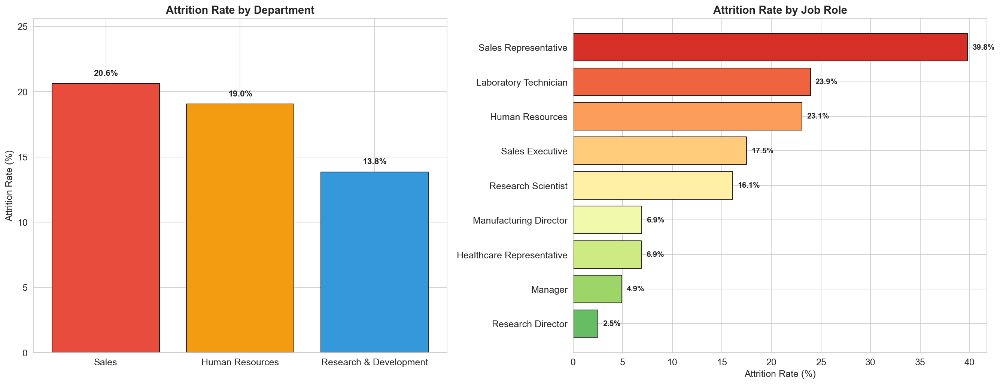
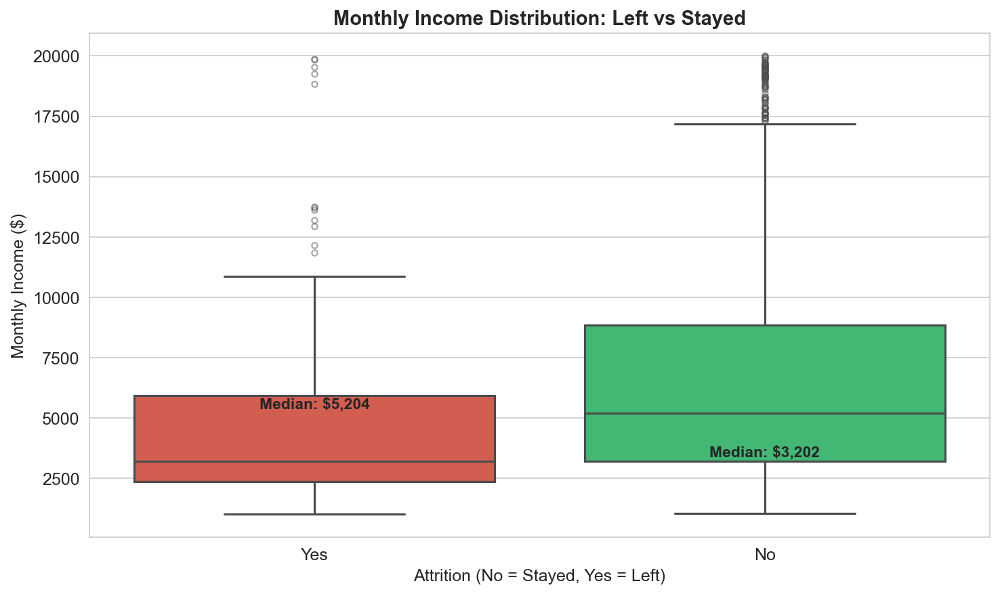
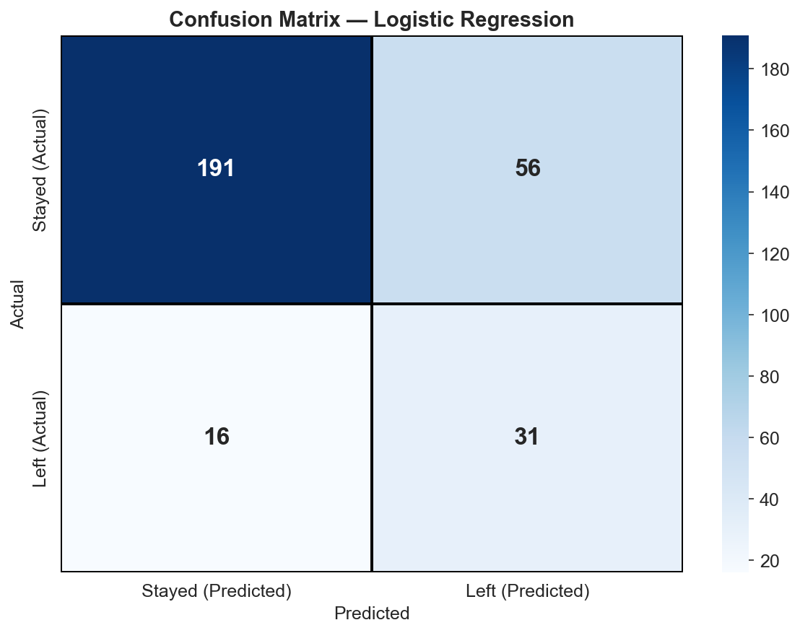
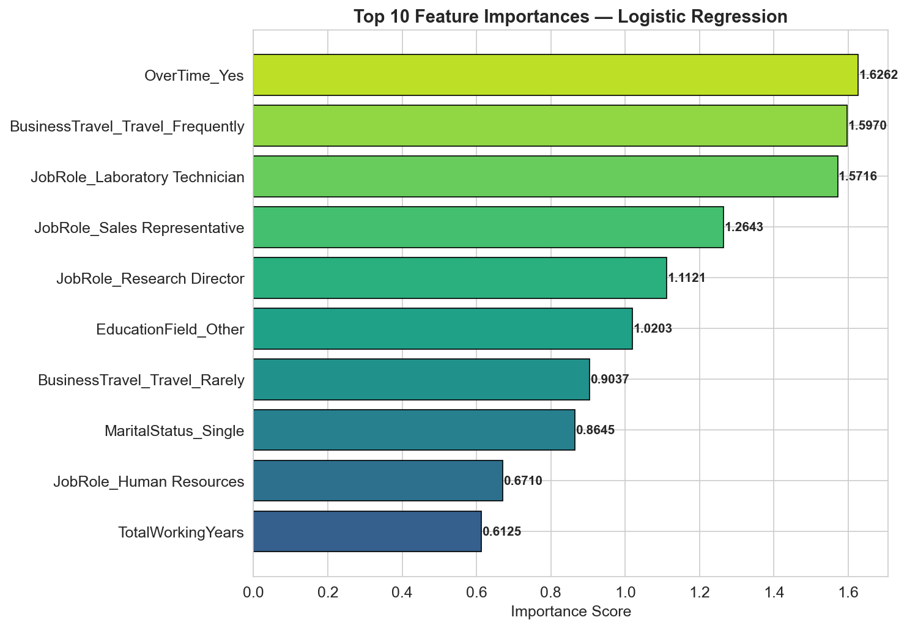
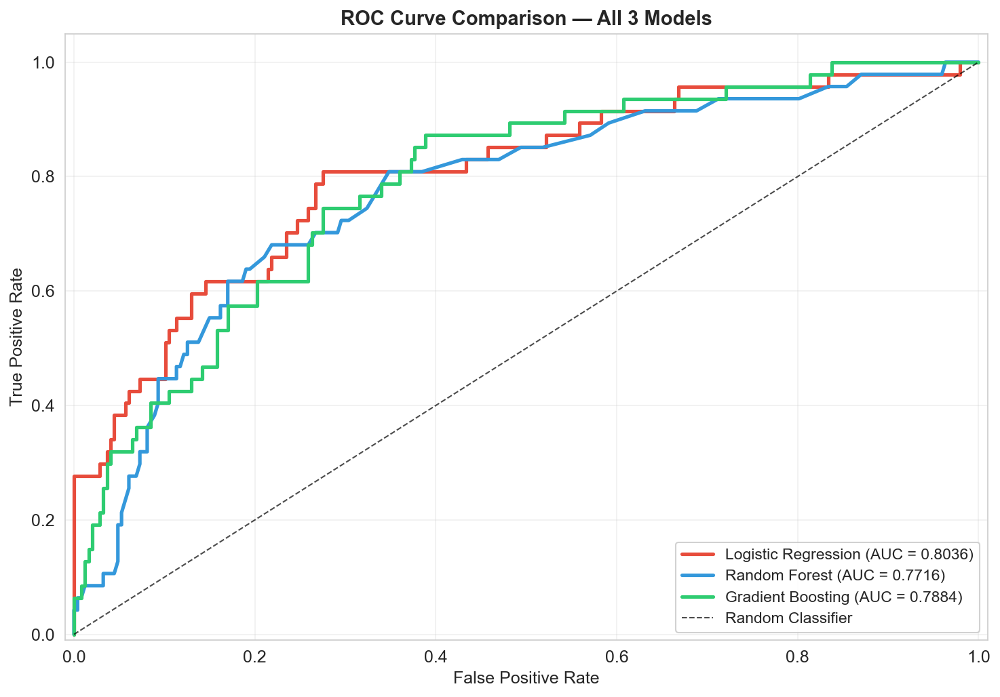
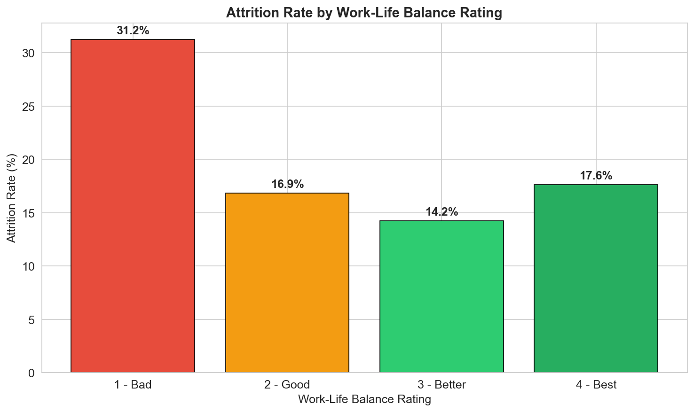
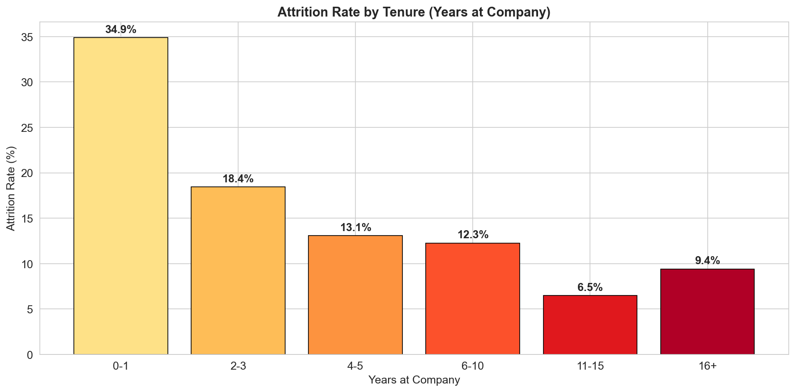

# 🏢 Employee Attrition Prediction using Machine Learning

<div align="center">


**Predicting employee turnover before it happens — so HR can act, not react.**

</div>

---

## 📌 Problem Statement

Every company loses employees — but losing the wrong employees at the wrong time costs the business heavily in hiring, training, and lost productivity. This project builds a **Machine Learning system** that predicts whether an employee is likely to leave the company based on factors like job satisfaction, salary, work-life balance, years at the company, and performance ratings.

The goal is to deliver **actionable insights** that an HR team could implement immediately to reduce attrition.

---

## 📊 Dataset

- **Source:** [IBM HR Analytics Employee Attrition Dataset](https://www.kaggle.com/datasets/pavansubhasht/ibm-hr-analytics-attrition-dataset) (Kaggle)
- **Size:** 1,470 employees × 35 features
- **Target Variable:** `Attrition` (Yes/No)
- **Attrition Rate:** 16.12% (imbalanced dataset)

---

## 🔍 Key Findings

| Insight | Detail |
|---------|--------|
| 📉 **Overall Attrition Rate** | 16.12% — only 237 out of 1,470 employees left |
| 🏬 **Highest Risk Department** | Sales (20.6% attrition) |
| 👔 **Highest Risk Role** | Sales Representative (39.8% attrition — nearly 4 in 10 leave) |
| 💰 **Income Gap** | Employees who left earned ~$2,000/month less on average |
| ⏰ **#1 Predictor** | Overtime — employees working overtime are 3× more likely to leave |
| 📅 **Most Vulnerable Period** | First year (0–1 years tenure: 34.9% attrition) |

---

## 🤖 Models & Results

Three classification models were trained and compared:

| Model | Accuracy | Precision | Recall | F1-Score | ROC-AUC |
|-------|----------|-----------|--------|----------|---------|
| **Logistic Regression** 🏆 | 0.7551 | 0.3563 | 0.6383 | 0.4627 | **0.8036** |
| Random Forest | 0.8435 | 0.5000 | 0.0851 | 0.1481 | 0.7716 |
| Gradient Boosting | 0.8469 | 0.4444 | 0.1702 | 0.2857 | 0.7884 |

> **Best Model: Logistic Regression** — highest ROC-AUC (0.8036) and best recall for identifying at-risk employees. It also has the advantage of being the most explainable model for HR teams.

---

## 📈 Visualizations

### Attrition by Department & Job Role
<p align="center">
  
</p>

### Monthly Income — Who Left vs Who Stayed
<p align="center">
  
</p>

### Confusion Matrix — Best Model (Logistic Regression)
<p align="center">
  
</p>

### Top 10 Feature Importances
<p align="center">
  
</p>

### ROC Curve Comparison — All 3 Models
<p align="center">
  
</p>

### Work-Life Balance & Tenure Analysis
<p align="center">
  
  
</p>

---

## 💡 HR Recommendations

1. **Create an "Overtime Watch" Program** — Flag employees working overtime for 3+ months, schedule manager check-ins, review staffing levels in Sales
2. **Launch a "First Year Retention" Initiative** — Assign mentors to new Sales hires, conduct 30/60/90-day check-ins, provide clear promotion pathways

---

## 📁 Project Structure

```
EmployeeAttrition_Maviya/
├── analysis.ipynb          # Complete Jupyter Notebook (all 7 tasks)
├── HR_Attrition.csv        # Dataset (1,470 rows × 35 columns)
├── summary.docx            # 1-page HR Director summary (non-technical)
├── summary.md              # Summary in Markdown format
├── README.md               # This file
└── charts/                 # All visualization PNGs
    ├── chart1_attrition_by_dept_role.png
    ├── chart2_income_boxplot.png
    ├── chart3_confusion_matrix.png
    ├── chart4_feature_importance.png
    ├── chart5_roc_curve_comparison.png
    ├── eda_worklifebalance.png
    └── eda_years_at_company.png
```

---

## ✅ Tasks Completed

- [x] **Task 1** — Data Loading & Exploration (shape, dtypes, attrition rate, imbalance observation)
- [x] **Task 2** — Data Cleaning & Preprocessing (null check, drop constants, encoding, scaling)
- [x] **Task 3** — Exploratory Data Analysis with 5 specific business insights
- [x] **Task 4** — Model Building & Comparison (3 models with `class_weight='balanced'`)
- [x] **Task 5** — Model Evaluation (Precision, Recall, F1, ROC-AUC, Confusion Matrix, Feature Importance)
- [x] **Task 6** — 7 Visualizations (5 required + 2 bonus)
- [x] **Task 7** — HR Insights & Business Recommendations

---

## 🛠️ Tech Stack

| Tool | Purpose |
|------|---------|
| Python 3.x | Main programming language |
| Jupyter Notebook | Interactive development environment |
| Pandas | Data loading, cleaning, and manipulation |
| NumPy | Numeric operations |
| Scikit-learn | Preprocessing, models, and evaluation |
| Matplotlib | Charts and visualization |
| Seaborn | Statistical visualization |

---

## 🚀 How to Run

```bash
# Clone the repository
git clone https://github.com/maviyamustahsin/EmployeeAttrition_Maviya.git
cd EmployeeAttrition_Maviya

# Install dependencies
pip install pandas numpy scikit-learn matplotlib seaborn jupyter

# Launch the notebook
jupyter notebook analysis.ipynb
```

---

<div align="center">

 **Maviya** | June 2026

</div>
